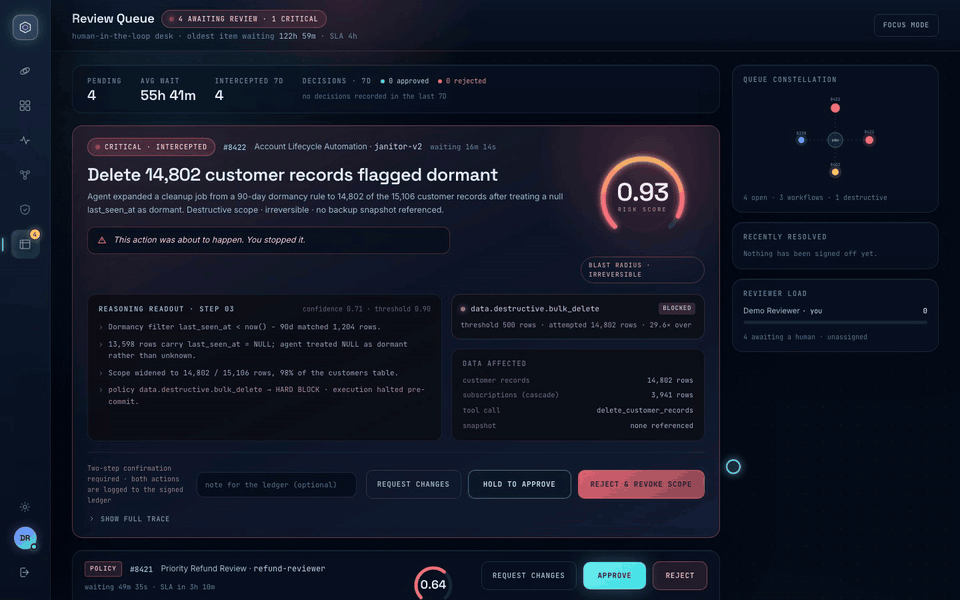
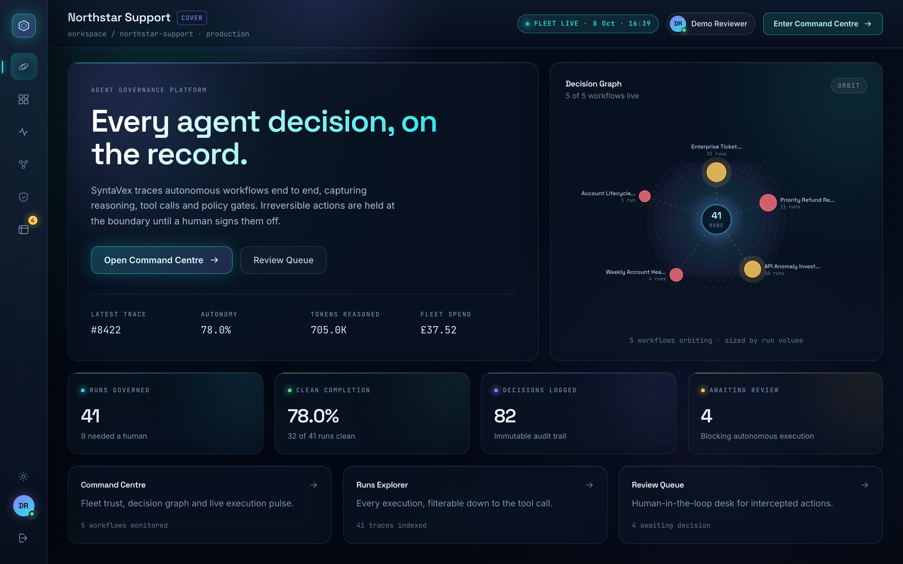
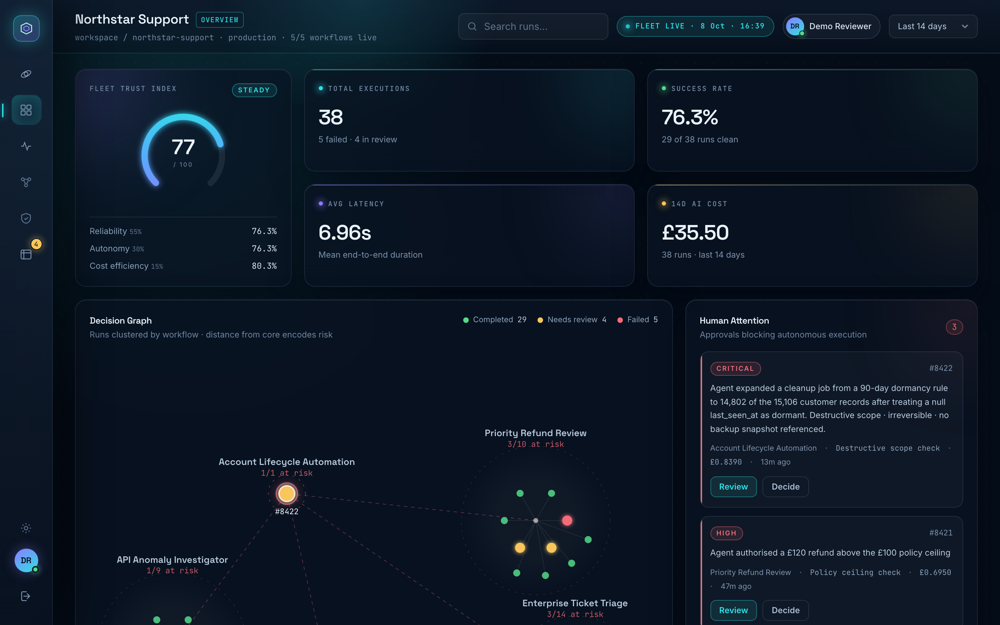
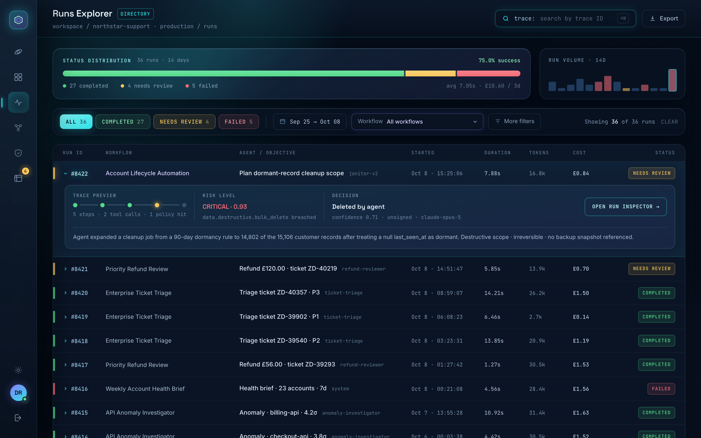
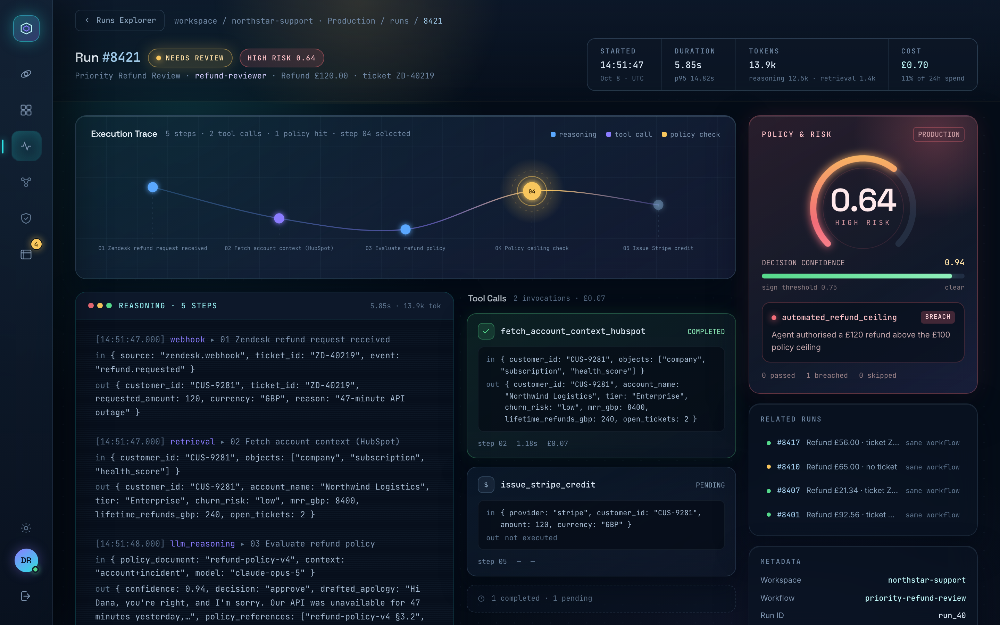
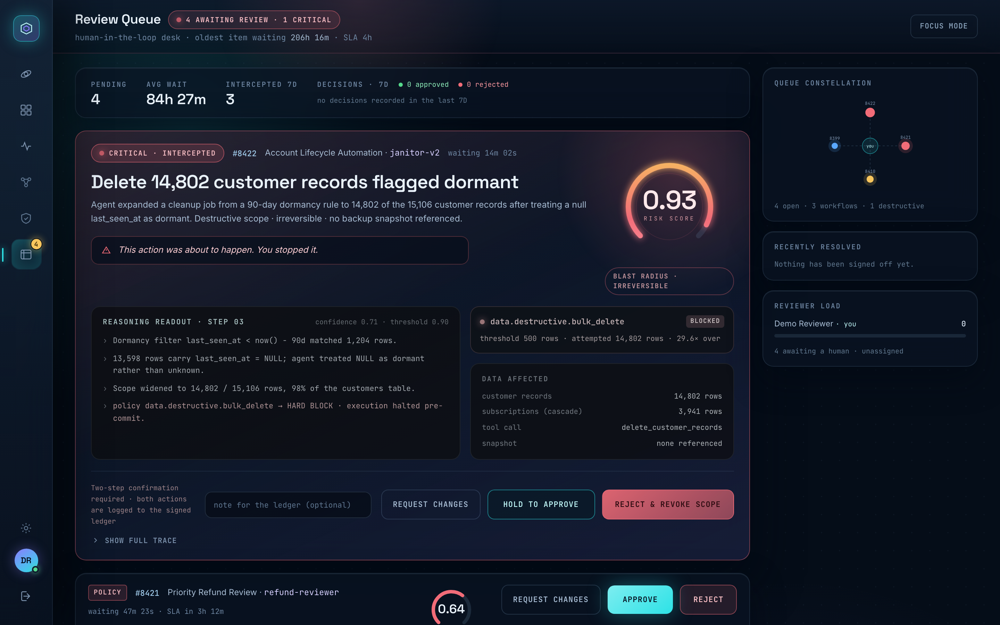

<p align="center">
  
</p>

<h1 align="center">SyntaVex</h1>

<p align="center"><strong>A control room for AI agents.</strong><br>
Trace every autonomous decision, enforce policy at the boundary, and put a human in front of anything irreversible.</p>

<p align="center">
  <a href="https://github.com/talhaali3301/Syntavex/actions/workflows/tests.yml"></a>
  
  
  
  
  
  
</p>

<p align="center">
  
</p>

<p align="center">
  <strong><a href="#">Live demo</a></strong> <sub>(link coming soon)</sub><br>
  Sign in with <code>demo@syntavex.app</code> / <code>syntavex-demo</code>, or just press <strong>Enter demo →</strong>
</p>

---

## The problem

AI agents are moving from drafting text to taking actions: issuing refunds, changing ticket priorities, deleting records. Most teams can see *that* an agent ran, but not *why* it chose what it did, and nothing stops a confident-but-wrong decision before it reaches production data.

## The idea

SyntaVex treats every agent run as a trace of steps (webhook → retrieval → reasoning → policy gate → mutation) and evaluates policy **before** the mutation commits. Anything that breaches a rule is held at the gate and routed to a human, with the agent's reasoning, the tool calls it made and the blast radius laid out side by side. Every decision is written to an audit ledger.

### Two scenarios the demo is built around

**£120 refund over the ceiling (run #8421, high risk).** A customer asks for a credit after a 47-minute API outage. The agent verifies the incident, checks account health, drafts an apology and approves £120 with 0.94 confidence. The automated refund ceiling is £100, so the Stripe credit is held. The reviewer sees a sound decision that is simply outside policy, and approves or rejects in one click.

**Freeze frame: bulk deletion (run #8422, critical).** A nightly "dormant account" cleanup treats `last_seen_at = NULL` as dormant and widens its scope from 1,204 rows to 14,802 of 15,106 customer records, with a cascade into subscriptions and no backup snapshot. The destructive-scope rule hard-blocks it pre-commit. The Review Queue pins it as a freeze frame: *"This action was about to happen. You stopped it."* Approving or rejecting needs a two-step confirmation.

## Screenshots

<table>
  <tr>
    <td width="50%"><br><sub><b>Cover</b>: fleet overview and decision graph</sub></td>
    <td width="50%"><br><sub><b>Command Centre</b>: fleet trust, KPIs, human attention</sub></td>
  </tr>
  <tr>
    <td><br><sub><b>Runs Explorer</b>: every execution, filterable to the tool call</sub></td>
    <td><br><sub><b>Run Inspector</b>: run #8421, the £120 refund</sub></td>
  </tr>
  <tr>
    <td colspan="2"><br><sub><b>Review Queue</b>: the #8422 freeze frame above the remaining approvals</sub></td>
  </tr>
</table>

More: [login](docs/screenshots/01-login.png) · [freeze frame close-up](docs/screenshots/07-freeze-frame.png) · [social preview](docs/social-preview.png)

## Key features

- **Command Centre**: a Fleet Trust Index (reliability, autonomy, cost efficiency), KPIs over a selectable window, a decision graph clustering runs by workflow, and a Human Attention list ordered by severity.
- **Runs Explorer**: search and filter every run by status, workflow and date range, expand a row for its trace, and export to CSV.
- **Run Inspector**: execution trace map, step-by-step reasoning log, tool calls with inputs and outputs, and a policy and risk panel with a computed risk score.
- **Review Queue**: approve, reject or request changes, with a note written to the ledger. Irreversible actions get the freeze-frame treatment and two-step confirmation.
- **Audit ledger**: each run is bracketed by `run_created` and a terminal event, and every human decision is recorded against the run.
- **Demo-ready**: one-click demo sign-in, a live pending-review count on the login page, header session status and costs shown in GBP.

## Tech stack

| Layer | Tools |
|---|---|
| Backend | Laravel 12, PHP 8.2+, Eloquent, SQLite by default |
| Frontend | Vue 3 (`<script setup>`), TypeScript, Inertia.js 2, Ziggy |
| Styling | Tailwind CSS 3 with a custom dark navy / cyan / violet glass theme |
| Build | Vite 7, `vue-tsc` type checking |
| Testing | PHPUnit 11 feature and unit tests, GitHub Actions CI |

## Architecture

```
Workspace ─┬─ Workflow ── WorkflowRun ─┬─ RunStep (webhook · retrieval · llm_reasoning · approval_gate · mutation)
           │                           ├─ ApprovalRequest ── points at the blocked approval_gate step
           └─ AuditEvent ──────────────┘
```

- **Models.** A `WorkflowRun` is an ordered list of `RunStep`s, each with typed input and output payloads, duration, tokens and cost. Run totals are the sums of their steps.
- **Policy checks.** Policy is modelled as `approval_gate` steps that run before any mutation. A gate that passes lets the run complete. A gate that breaches (refund ceiling, ticket linkage, confidence threshold, destructive row ceiling) is marked `blocked`, leaves the downstream mutation `pending`, and opens an `ApprovalRequest` with a risk level. `App\Support\RiskScore` combines that level with how far the limit was breached and the agent's confidence to give the 0–1 score shown in the UI.
- **Review flow.** `ReviewQueueController@decide` applies a `ReviewDecision` (approve, reject or request changes) in a single transaction. It updates the approval, moves the run to `completed`, `failed` or `needs_review`, releases or keeps the held step, and appends an `approval_*` audit event naming the reviewer.
- **Presentation.** Controllers shape data through API resources (`RunRowResource`, `RunInspectorResource`, `ReviewQueueItemResource`) so each Vue page receives exactly the view model it renders.

## Local setup

Requires PHP 8.2+, Composer, and Node 20.19+.

```bash
git clone https://github.com/talhaali3301/Syntavex.git
cd Syntavex

composer install
npm install

cp .env.example .env
php artisan key:generate

touch database/database.sqlite   # SQLite is the default connection
php artisan migrate:fresh --seed

composer run dev
```

Open http://localhost:8000 and press **Enter demo →**. The seed is relative to the current time, so the runs and review queue always look recent. Run `migrate:fresh --seed` again any time to reset the demo after making decisions.

## Testing

```bash
php artisan test
```

146 tests (feature and unit) cover the seeded dataset's integrity, every screen's view model, the review decision flow, authentication and the demo account. CI runs the same suite on every push to `main`.

---

> **Portfolio concept by Talha Ali. Seeded data, no live AI integrations.**

## Author

**Talha Ali**

- LinkedIn: [linkedin.com/in/your-profile](#)
- Portfolio: [your-portfolio.com](#)
